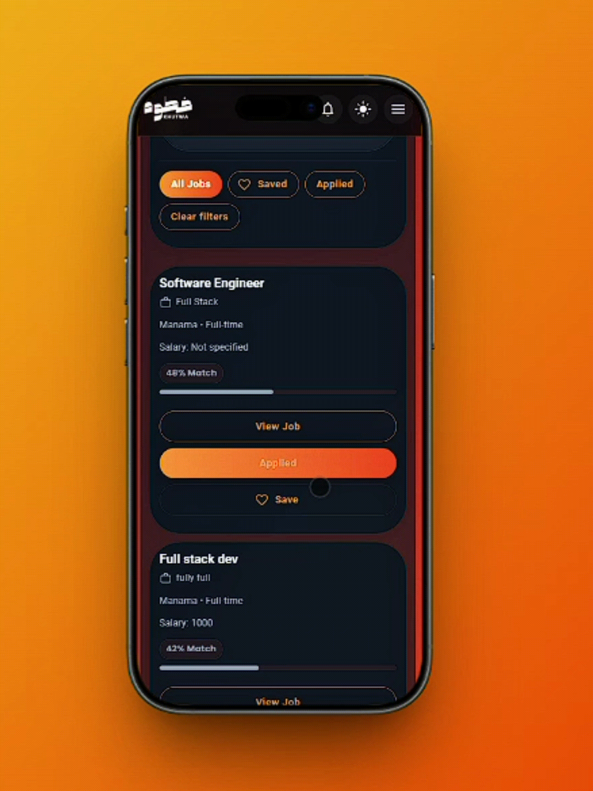
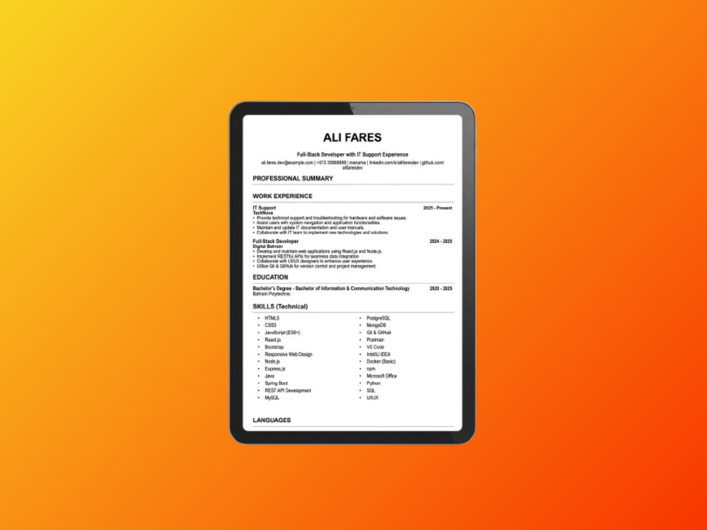
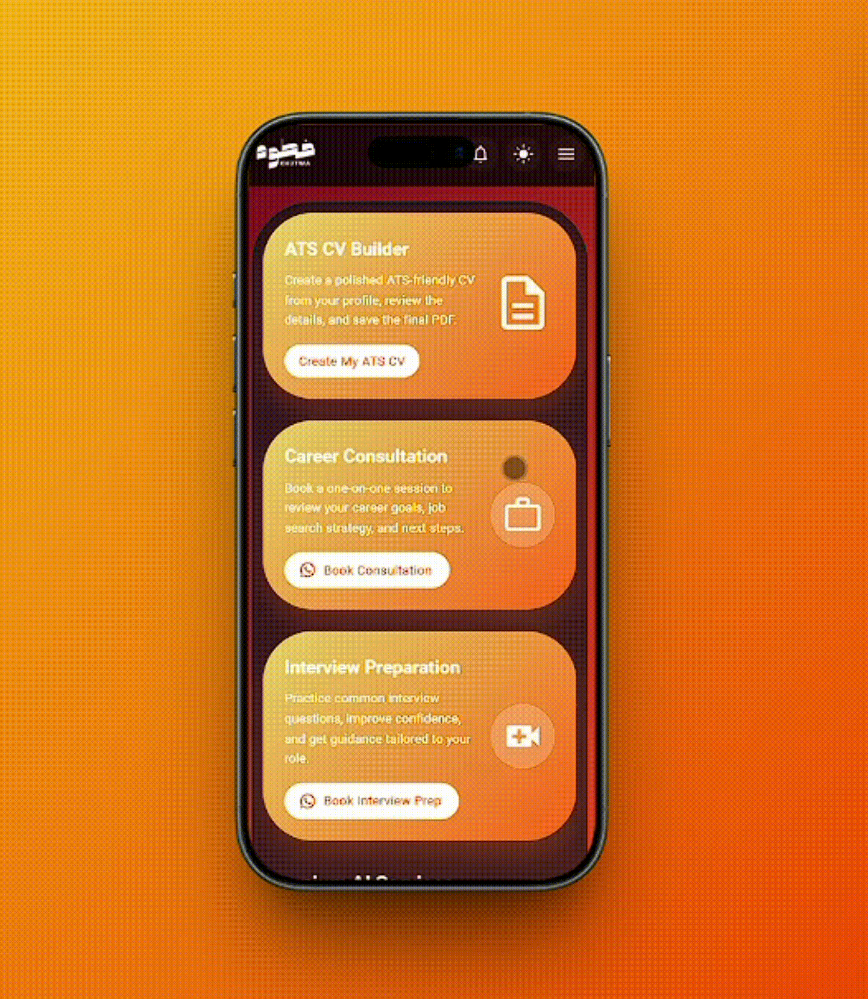

# 💼 AI Recruitment Platform

A full-stack recruitment platform designed to streamline the recruitment process for candidates, employers, and administrators. The platform combines job management, application tracking, CV processing, dashboards, and AI-assisted recruitment features in one system.


# Candidate Experience


## Home & Navigation

The candidate interface provides access to available job opportunities, applications, profile management, notifications, and other recruitment features.

The home page also displays job matching percentages to help candidates identify opportunities that align with their profile and CV. Job opportunities are presented with the highest matching percentages at the top, making it easier for candidates to quickly identify the most relevant positions.


## Jobs & Applications

Candidates can browse available job opportunities, apply for positions, and track the status of their applications.





## ATS CV Generation
The platform provides an ATS-focused CV generation workflow to help candidates create structured and job-ready resumes.





## Light & Dark Mode
The interface supports different visual themes to provide a more comfortable and personalized user experience.





---

# Employer Experience

## Employer Dashboard
Employers can access their recruitment dashboard to manage job postings, applicants, and hiring activities.


## Application Management

Employers can review submitted applications, view detailed candidate information, and manage application statuses throughout the recruitment process.

Applications are automatically organized using candidate-to-job matching percentages, placing candidates with higher matches toward the top of the application list. This allows employers to quickly identify candidates whose profiles and CVs are more closely aligned with the requirements of the posted position.


---

# Administrator Experience

## Administrator Dashboard
Administrators can monitor and manage recruitment activity across the platform.


## Candidate & Recruitment Management
The administrator interface provides tools for managing candidates, recruitment information, and overall platform activities.

Administrators can view and filter candidate information to easily find and manage applicants within the recruitment system. Candidate statuses can also be updated manually, allowing administrators to keep track of each candidate's current stage and progress throughout the recruitment process.


## AI Keyword Matching
AI-assisted keyword matching helps connect candidate profiles with relevant job opportunities based on skills and profile information.


## Sales & Recruitment Analytics
Administrative analytics provide an overview of recruitment and platform activity.


# Key Features

### Candidate

- Created and managed professional profiles
- Uploaded and processed CVs
- Applied for jobs and tracked applications
- Received job recommendations
- Generated ATS-optimized CVs
- Received recruitment notifications
- Used AI-assisted job matching

### Employer

- Created, edited, and managed job postings
- Reviewed applications and candidate CVs
- Updated application statuses
- Tracked recruitment progress
- Searched and filtered candidates
- Managed applicants through the recruitment workflow

### Administrator

- Managed candidate, employer, and job information
- Approved company accounts
- Monitored recruitment activity and analytics
- Updated candidate and application statuses
- Managed recruitment records
- Generated recruitment reports

### AI-Assisted Recruitment
- AI-powered CV parsing and data extraction
- Candidate-job matching and match percentage scoring
- AI keyword candidate matching 
- AI keyword employer candidate search 
- ATS CV generation
- Candidate strengths and missing-skills analysis
- AI-assisted match explanations


---

# Technologies

**Frontend:** React.js, Material UI (MUI), Vite, React Router DOM

**Backend:** Node.js, Express.js

**Database & Cloud:** PostgreSQL, Supabase

**Authentication & Security:** JWT, bcrypt, Google OAuth

**AI Integration:** OpenAI API, OpenAI Embeddings

**Development & Deployment:** Git, Docker, Render

**Design & Development Tools:** Figma, dbdiagram.io, Eraser.io, Thunder Client, Visual Studio Code

---


# My Contribution

Designed and developed the platform across the frontend and backend, implemented database structures and REST APIs, developed role-based dashboards and recruitment workflows, integrated authentication and CV processing, and implemented AI-assisted recruitment and ATS CV functionality.

---

# Project Notes

This repository is a public portfolio version of my internship and graduation project, developed during my work with the company.

The repository is intended to demonstrate the project's architecture, development work, implemented features, and user interface. Private company credentials, database access, API keys, OpenAI configuration, environment variables, and other sensitive resources are not included.

Some functionality depends on external services and private configuration that are not included in the public repository. As a result, certain features may not be fully available when the project is run locally or when the deployed demonstration is unavailable.

The screenshots and GIF demonstrations in this README showcase the application's implemented features and user interface.

# Running the Project Locally

### Requirements

- Node.js
- npm
- Docker
- Docker Compose

### Installation

Install the project dependencies:

```bash
npm install
