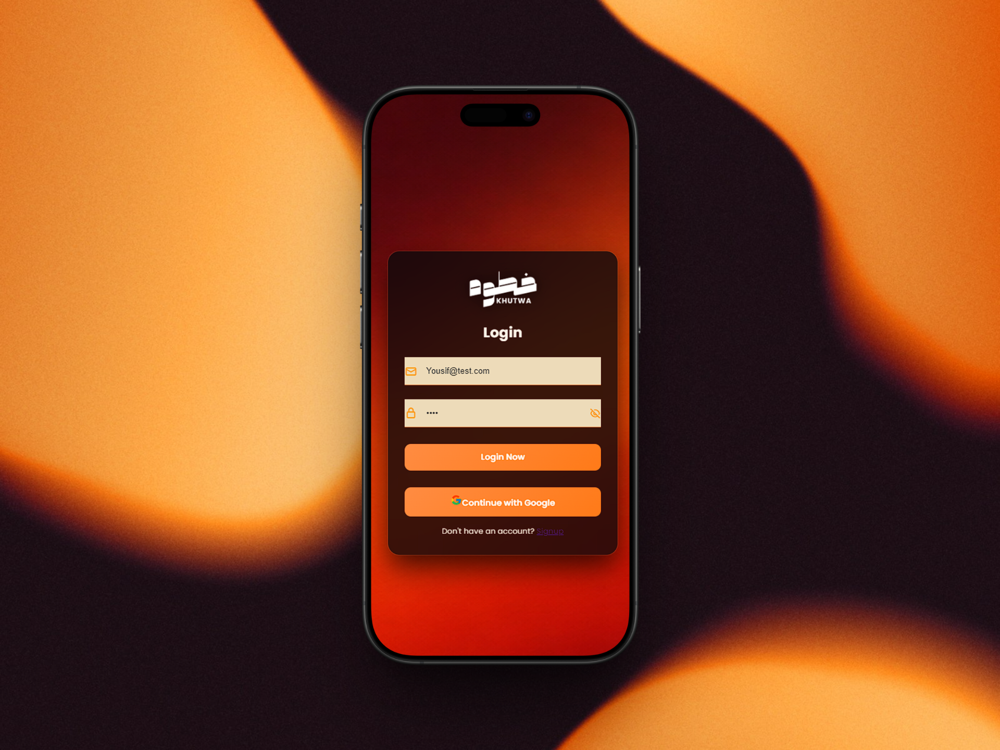
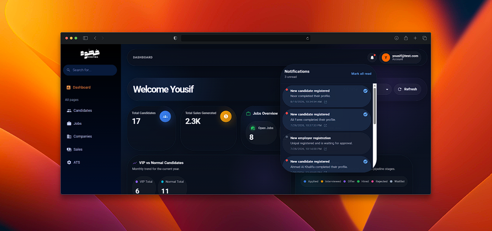
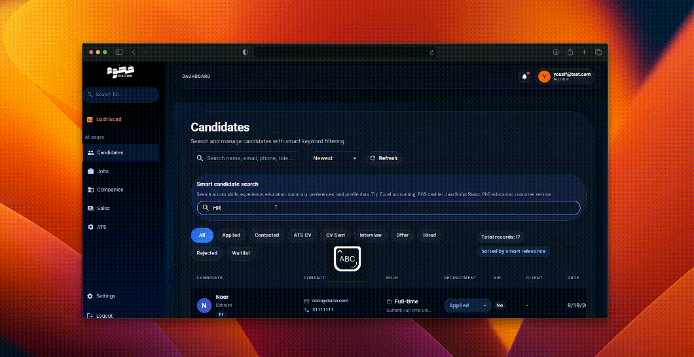
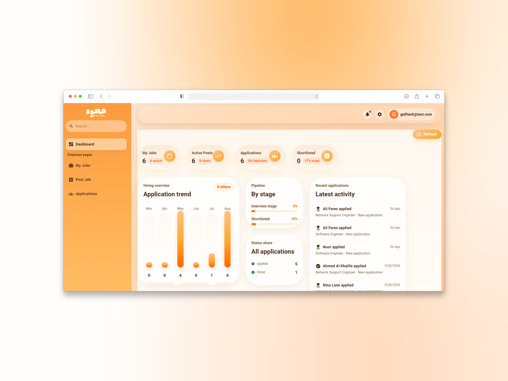
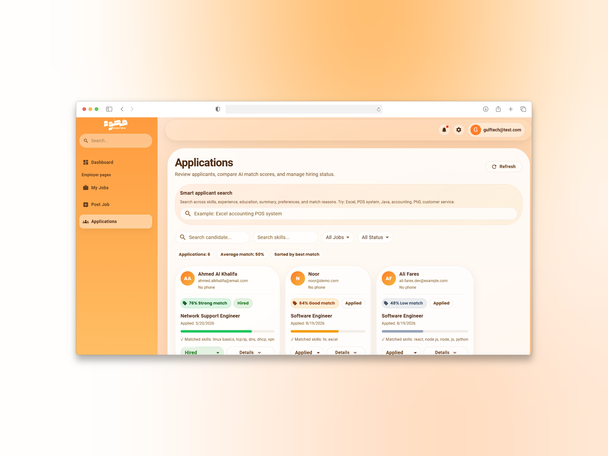
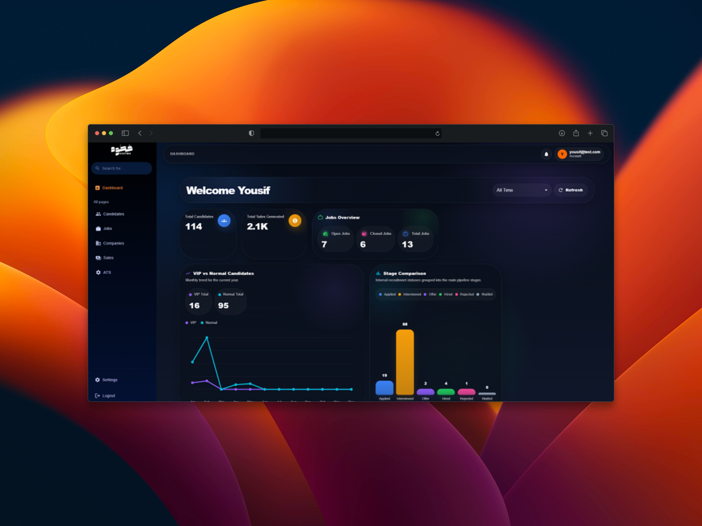
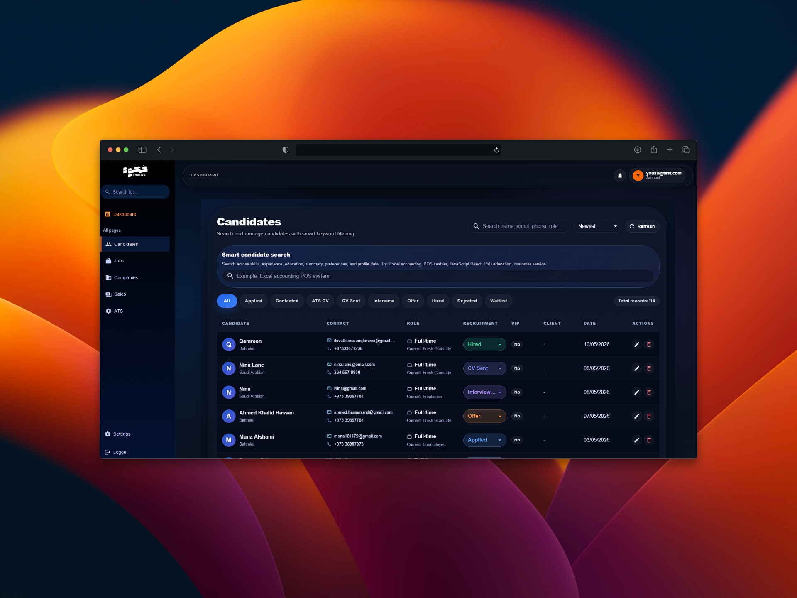
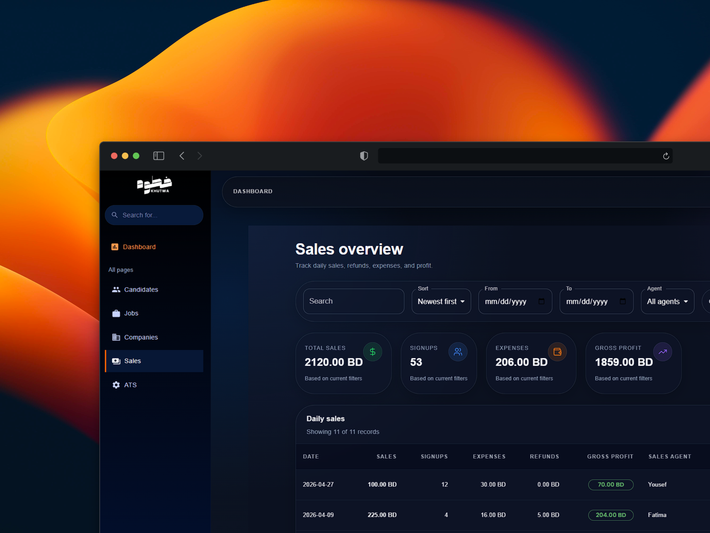

# AI Recruitment Platform

A full-stack recruitment platform designed to streamline the recruitment process for candidates, employers, and administrators. The platform combines job management, application tracking, CV processing, dashboards, and AI-assisted recruitment features in one system.

## Project Demo

A visual walkthrough of the platform showcasing the main workflows and user experiences across the candidate, employer, and administrator sides of the system.

---

# Candidate Experience

## Login/Sign up

## Home & Navigation

The candidate interface provides access to available jobs, applications, profile management, notifications, and other recruitment features.

## Profile Management

Candidates can create and manage their professional profiles, including personal information, education, skills, and experience.

## Jobs & Applications

Candidates can browse available job opportunities, apply for positions, and track the status of their applications.

## ATS CV Generation

The platform provides an ATS-focused CV generation workflow to help candidates create structured and job-ready resumes.

## Notifications

Candidates can receive and view notifications related to their recruitment activity and applications.

## AI Keyword Matching

AI-assisted keyword matching helps connect candidate profiles with relevant job opportunities based on skills and profile information.

## Light & Dark Mode

The interface supports different visual themes to provide a more comfortable and personalized user experience.

---

# Employer Experience

## Employer Dashboard

Employers can access their recruitment dashboard to manage job postings, applicants, and hiring activities.

## Application Management

Employers can review submitted applications, view candidate information, and manage application statuses throughout the recruitment process.

---

# Administrator Experience

## Administrator Dashboard

Administrators can monitor and manage recruitment activity across the platform.

## Candidate & Recruitment Management

The administrator interface provides tools for managing candidates, recruitment information, and platform activities.

## Sales & Recruitment Analytics

Administrative analytics provide an overview of recruitment and platform activity.

---

# Key Features

### Candidate

- Created and managed professional profiles
- Uploaded and processed CVs
- Applied for jobs and tracked applications
- Received job recommendations
- Generated ATS-optimized CVs
- Received recruitment notifications
- Used AI-assisted job matching

### Employer

- Created, edited, and managed job postings
- Reviewed applications and candidate CVs
- Updated application statuses
- Tracked recruitment progress
- Searched and filtered candidates
- Managed applicants through the recruitment workflow

### Administrator

- Managed candidate, employer, and job information
- Approved company accounts
- Monitored recruitment activity and analytics
- Updated candidate and application statuses
- Managed recruitment records
- Generated recruitment reports

### AI-Assisted Recruitment
- AI-powered CV parsing and data extraction
- Candidate-job matching and match percentage scoring
- AI keyword candidate matching 
- AI keyword employer candidate search 
- ATS CV generation
- Candidate strengths and missing-skills analysis
- AI-assisted match explanations

---

# Technologies

**Frontend:** React.js, Material UI (MUI), Vite, React Router DOM

**Backend:** Node.js, Express.js

**Database & Cloud:** PostgreSQL, Supabase

**Authentication & Security:** JWT, bcrypt, Google OAuth

**AI Integration:** OpenAI API, OpenAI Embeddings

**Development & Deployment:** Git, Docker, Render

**Design & Development Tools:** Figma, dbdiagram.io, Eraser.io, Thunder Client, Visual Studio Code

---

# System Overview

The platform was developed using a modular full-stack architecture consisting of a React frontend, Node.js and Express.js backend, PostgreSQL database, Supabase cloud services, and AI-assisted recruitment functionality.

The system supports separate workflows and dashboards for candidates, employers, and administrators while providing centralized recruitment and application management.

---

# My Contribution

Designed and developed the platform across the frontend and backend, implemented database structures and REST APIs, developed role-based dashboards and recruitment workflows, integrated authentication and CV processing, and implemented AI-assisted recruitment and ATS CV functionality.

---
